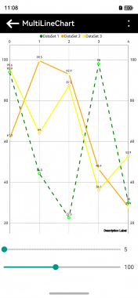
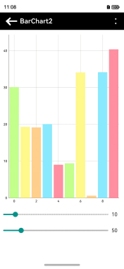
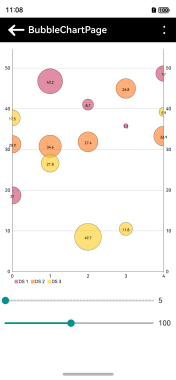
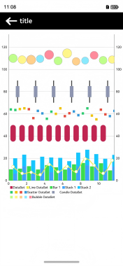
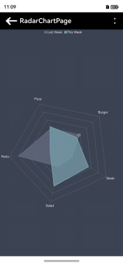
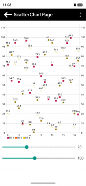
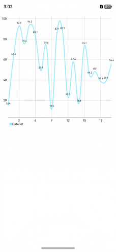

# ⚡ 快速开始

## 功能总览

`MpChart 图表库`包含以下图表：

包名|说明|示意图
-|-|-
LineChart|线形图（包括折线图和曲线图）|
BarChart|柱状图（包括竖向柱状图和横向柱状图）|
PieChart|饼状图|
BubbleChart|气泡图|
CandleStickChart|蜡烛图|
CombinedChart|组合图|
RadarChart|雷达图|
ScatterChart|散点图|
WaterfallChart|瀑布图|

:::tip 提示
基本图表类型涵盖了上述内容，而更多样式则可以通过调整设置参数来改变，您可以通过运行程序来查看这些多样化的样式。😄
:::

## 线形图简单示例
> 在终端输入以下命令，下载安装ohos/mpchart

> OpenHarmony ohpm环境配置等更多内容，请参考 [如何安装OpenHarmony ohpm包 。](https://gitee.com/openharmony-tpc/docs/blob/master/OpenHarmony_har_usage.md)
::: code-group
```sh [ohpm]
ohpm i @ohos/mpchart
```
:::

> 以线形图为例，具体代码如下

```typescript
import {
  JArrayList,
  EntryOhos,
  ILineDataSet,
  LineData,
  LineChart,
  LineChartModel,
  Mode,
  LineDataSet,
  XAxisPosition,
} from '@ohos/mpchart';

@Entry
@Component
struct Index {
  private model: LineChartModel = new LineChartModel();

  aboutToAppear() {
    // 创建一个 JArrayList 对象，用于存储 EntryOhos 类型的数据
    let values: JArrayList<EntryOhos> = new JArrayList<EntryOhos>();
    // 循环生成 1 到 20 的随机数据，并添加到 values 中
    for (let i = 1; i <= 20; i++) {
      values.add(new EntryOhos(i, Math.random() * 100));
    }
    // 创建 LineDataSet 对象，使用 values 数据，并设置数据集的名称为 'DataSet'
    let dataSet = new LineDataSet(values, 'DataSet');
    dataSet.setMode(Mode.CUBIC_BEZIER);
    dataSet.setDrawCircles(false);
    let dataSetList: JArrayList<ILineDataSet> = new JArrayList<ILineDataSet>();
    dataSetList.add(dataSet);
    // 创建 LineData 对象，使用 dataSetList数据，并将其传递给model
    let lineData: LineData = new LineData(dataSetList);
    this.model?.setData(lineData);
    this.model.getAxisLeft()?.setAxisLineWidth(2);
    //设置x轴位置在底部
    this.model.getXAxis()?.setPosition(XAxisPosition.BOTTOM);
    //设置右边轴不生效
    this.model.getAxisRight()?.setEnabled(false);
    //设置左边轴的线条不显示
    this.model.getAxisLeft()?.setDrawAxisLine(false);
    //设置description不显示
    this.model.getDescription()?.setEnabled(false);
  }

  build() {
    Column() {
      LineChart({ model: this.model })
        .width('100%')
        .height('50%')
        .backgroundColor(Color.White)
    }
  }
}
```
## 线形图效果




